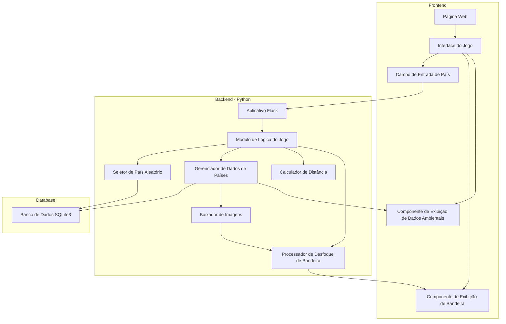

# MC656 - Engenharia de Software

Este é o nosso projeto da disciplina MC656 - Engenharia de Software, ofertada pela Universidade Estadual de Campinas aos cursos de graduação em Computação.

## Integrantes

247171 - Ícaro Chiabai

206768 - Vinicius Errero

232517 - Guilherme Braga

237575 - João Bonatti

## Descrição do projeto

### Ideia principal

Queremos fazer um jogo de navegador que consiste em tentativas e erros, o objetivo do usuário é acertar um país escolhido aleatóriamente pelo jogo. É disponibilizado para o jogador dados ambientais sobre o país a ser adivinhado e informações extras,como a bandeira, que poderá ter desfoque variável a depender do número de tentativas incorretas e dificuldade escolhida

São concedidas ao usuário um determinado número de tentativas para que acerte o país em questão. A cada tentativa, é exibido ao usuário a distância entre o país chutado e o escolhido e direção em que o país escolhido se encontra. Para facilitar, a bandeira torna-se mais nítida a medida que o usuário se aproxima do país nos chutes.

## Diagrama de funcionamento

### Descrição dos componentes e arquiteturas utilizadas

#### Estilos Arquiteturais Adotados

##### Arquitetura em Camadas (Layered Architecture)

Nossa aplicação segue o modelo de arquitetura em camadas, dividindo o sistema em três camadas principais:

###### Frontend

* Responsável pela interface do usuário
* Composta pela página web, interface do jogo e componentes de interação
* Lida com a exibição da bandeira, entrada de dados e feedback visual ao jogador

###### Backend

* Contém a lógica central do jogo
* Processa a seleção de países, cálculo de distâncias e controle de desfoque da bandeira
* Gerencia as regras e mecânicas do jogo

###### Camada de persistência (Database)

* Implementada com SQLite
* Armazena informações sobre países
* Fornece dados para as camadas superiores

##### Arquitetura Baseada em Componentes

Simultaneamente, o projeto adota uma arquitetura baseada em componentes, onde cada módulo possui responsabilidades específicas e bem definidas:

* CountryChooser: Responsável por selecionar países aleatoriamente
* DistanceCalculator: Calcula distâncias entre países
* FlagBlurProcessor: Processa o desfoque da bandeira
* CountryDataManager: Gerencia a obtenção de dados de países a partir do banco de dados
* GameLogic: Coordena a lógica central do jogo

#### Benefícios da Abordagem

* Modularidade: Cada componente pode ser desenvolvido, testado e mantido independentemente
* Reutilização: Componentes podem ser facilmente adaptados ou substituídos
* Flexibilidade: Facilita a evolução e expansão do sistema

A combinação desses dois estilos arquiteturais permite uma estrutura robusta, clara e extensível para o jogo.

#### Padrão de Projeto

O padrão de projeto escolhido para a Avaliação A4 é o **Strategy** e o componente escolhido para ser criado com esse padrão é o **DistanceCalculator**.

