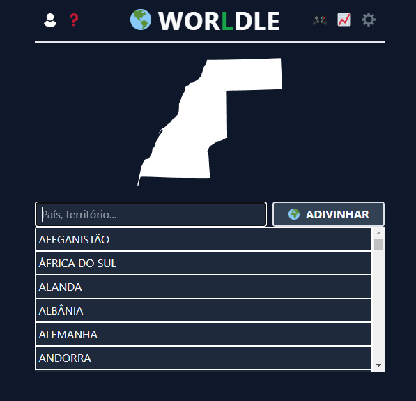
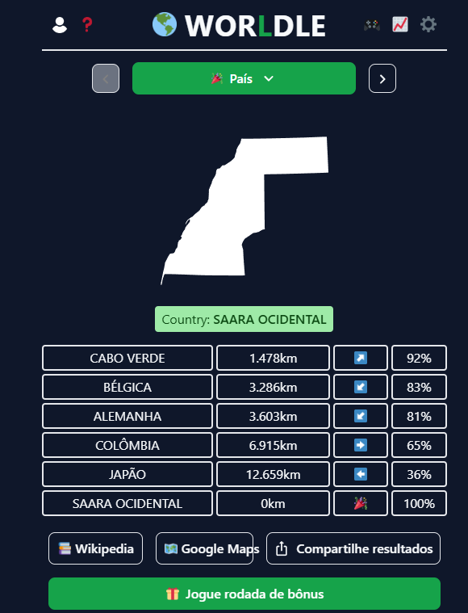
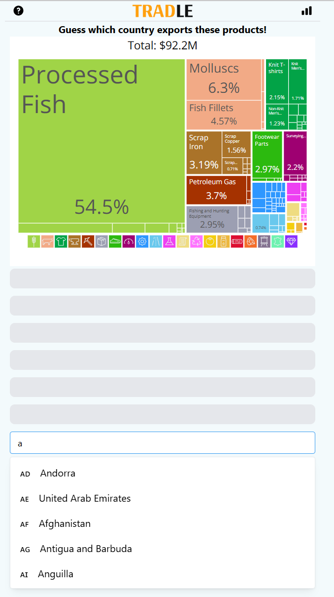
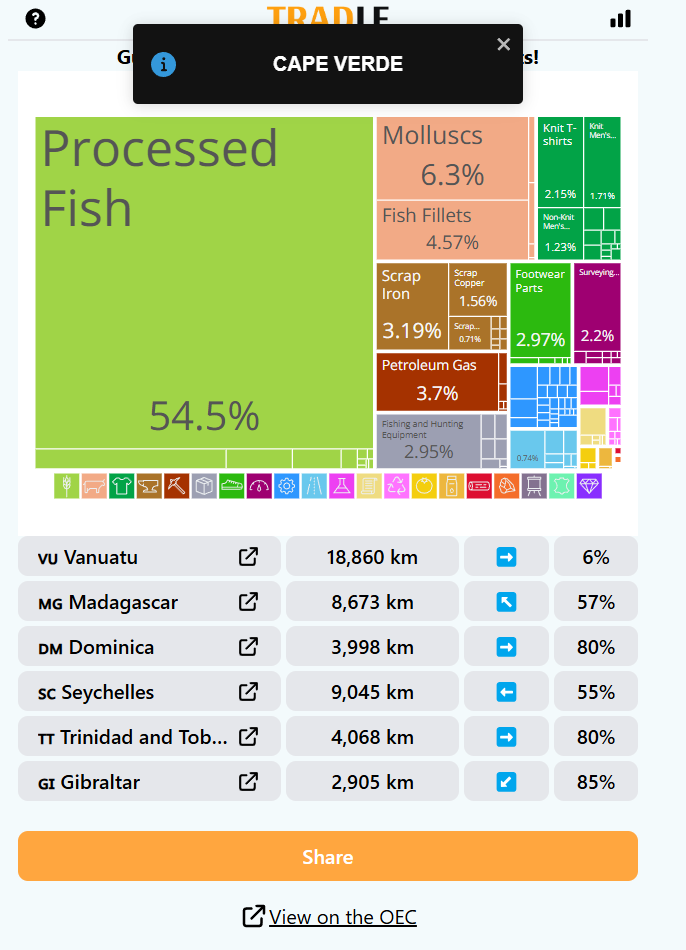
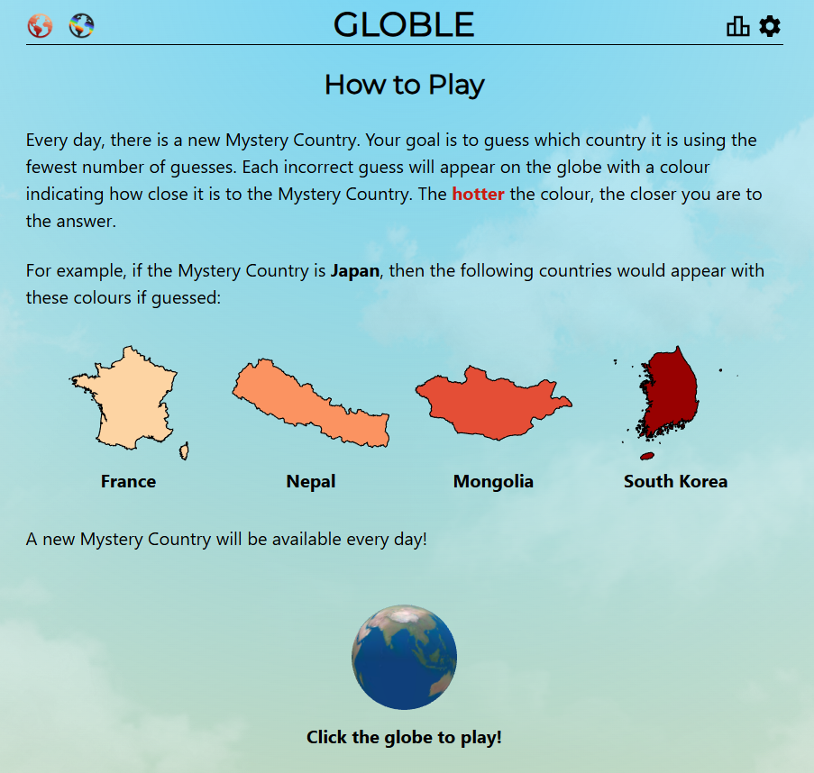
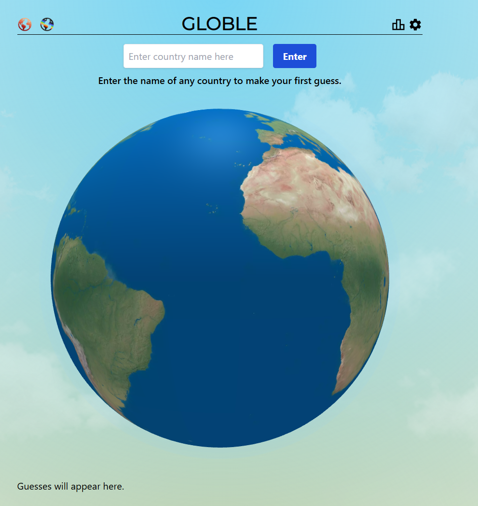
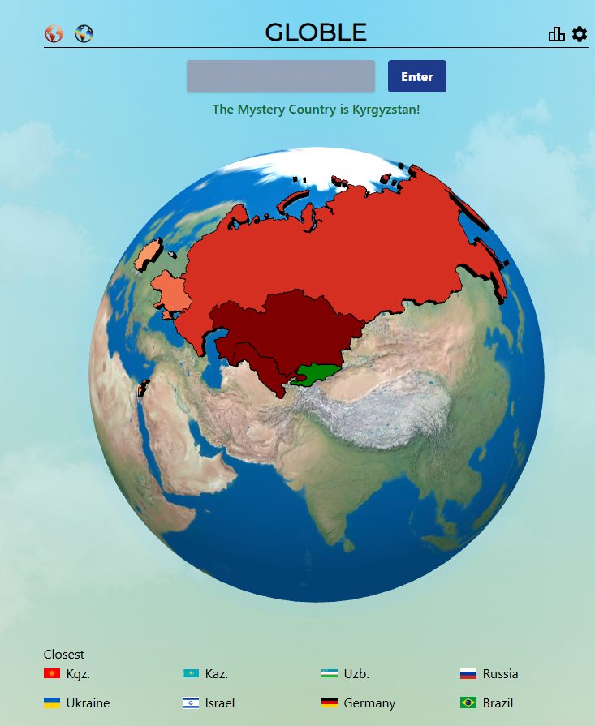
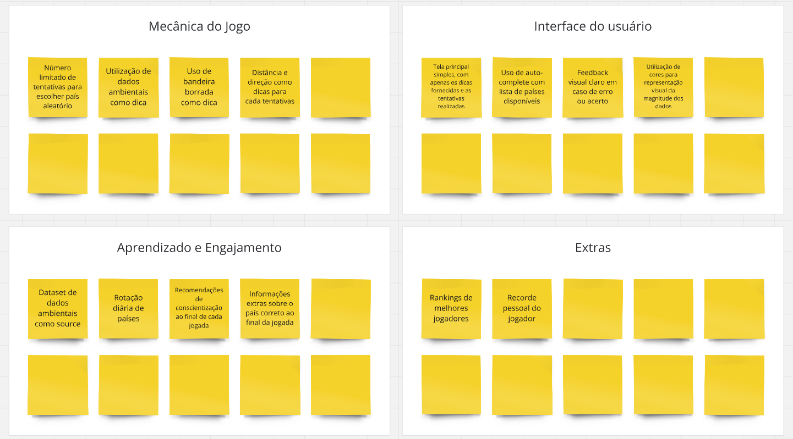

# Elicitação de Requisitos

Para a elicitação de requisitos utilizamos dois métodos muito conhecidos da Engenharia de Software o benchmarking e o brainstorming

## Benchmarking

### Aplicações analisadas

#### Worldle

O jogo desafia o usuário a adivinhar o país com base no formato do território e em dicas fornecidas após a primeira tentativa. O jogador tem 6 tentativas para acertar. Em cada tentativa incorreta, o jogo informa a distância e a direção relativa do país inserido em relação ao país correto. Se as 6 tentativas forem usadas sem sucesso, o jogo revela a resposta. Caso o usuário acerte antes, ele é parabenizado e informado do país correto.

##### Início do jogo

##### Fim do jogo

##### Pontos positivos

    * Facilidade de compreensão das informações
    * Boas dicas, como distância e direção relativa.

##### Pontos negativos

    * Falta de descrição das colunas na tabela de resultados
    * Ausência de opção para visualizar o mapa-múndi.

#### Tradle

O jogo Tradle desafia o usuário a adivinhar um país com base em seu quadro de exportações, incluindo porcentagens e valores brutos (em US$). Funciona de maneira similar ao Worldle, com 6 tentativas e dicas de distância e direção após cada erro. Caso o jogador não acerte, o jogo revela o país no final. Se o usuário acertar antes, é parabenizado.

##### Início do jogo

##### Fim do jogo

##### Pontos positivos

    * Utiliza informações não geográficas como dicas, o que se alinha ao nosso objetivo
    * Fácil entendimento, mas desafiador, pois os dados não são amplamente conhecidos
    * Boas dicas, como distância e direção relativa.

##### Pontos negativos

    * Falta de descrição das colunas na tabela de resultados
    * Interface inconsistente, com falhas de exibição das bandeiras em determinados dispositivos (por exemplo, Windows 11 e iPad).

#### Globle

O jogo Globle também tem como objetivo adivinhar o país, mas de forma interativa, utilizando um globo da Terra. Não há limite para o número de tentativas. Após cada palpite, o jogo informa a distância para o país correto.

##### Início do jogo

##### Fim do jogo

##### Pontos positivos

    * Uso de um globo interativo.
    * Texto explicativo no início do jogo sobre o funcionamento do mesmo

##### Pontos negativos

    * Ausência de auto-complete
    * Nomes dos países apenas em inglês.

### Funcionalidades de Interesse

    * Seleção de um novo país todo dia
    * Exibição da distância e direção em relação ao palpite do jogador
    * Uso de informações não geográficas como dica

## Brainstorming

O grupo se juntou em uma ligação e utilizou a plataforma Miro para fazer um brainstorming do projeto, dividindo as ideias em tópicos que julgamos mais essenciais para a realização da atividade e do projeto como um todo. O brainstorming resultou na imagem a seguir:

##### Brainstorming no Miro

